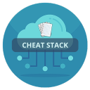

# CheatStack

If CheatStack helps you, consider giving us a ⭐ on **[GitHub](https://github.com/ArpitStack/cheat-stack)**! Your support encourages future development and helps others discover this tool!



**CheatStack** is a comprehensive cheatsheet tool for developers and DevOps professionals. It provides quick access to handy commands and tips for Git, Docker, Kubernetes, Cloud platforms, and more, all in one place. With CheatStack, you can speed up your workflow by referencing frequently used commands without having to search for them.

## 🚀 Features

1. 🧑‍💻 **Pre-built Command Collection**
   - A curated list of the most commonly used commands for DevOps, Git, Kubernetes, Docker, AWS, Azure, GCP, and more.

2. ⚡ **Searchable Cheatsheets**  
   - Quickly find commands for any topic through a searchable interface, making it easy to look up exactly what you need without wasting time.

3. 🔧 **Categorized Sections**
   - Commands are organized into categories like Git, Docker, Cloud, Kubernetes, etc., so you can navigate the cheatsheets easily.

4. 📚 **Markdown Support**  
   - Cheatsheets are written in markdown format, making it easy to contribute, extend, or customize them.

## 📖 How to Use

1. Browse the list of categories such as Git, Docker, Kubernetes, and Cloud commands.
2. Copy the command you need directly from the cheatsheet.
3. Customize the commands based on your specific use case or environment.
4. For advanced or custom commands, feel free to explore and extend the cheatsheet.

The cheatsheets are organized by categories for easy access.

###

## 📄 License

This project is licensed under the Apache License, Version 2.0 - see the [LICENSE](LICENSE) file for details.

###

## 🤝 Contributing

We welcome contributions! If you would like to contribute to **CheatStack**, please follow these steps:

1. **Fork the Repository**: Click the "Fork" button at the top-right of the repository page on GitHub.

2. **Clone Your Fork**:  
   Clone your forked repository to your local machine:
   ```bash
   git clone https://github.com/<YourUsername>/cheat-stack.git
   ```

3. **Create a New Branch**:  
   Always create a new branch for your changes to keep your work organized and separate from the main branch:
   ```bash
   git checkout -b your-branch-name
   ```

4. **Make Your Changes**:
   Implement your changes, whether it's adding a feature, or improving the documentation.

5. **Commit Your Changes**:
   Once you’ve made your changes, stage and commit them with a descriptive message:
   ```bash
   git add .
   git commit -m "Brief description of the changes"
   ```

6. **Push Your Changes**:
   Push your branch to your forked repository on GitHub:
   ```bash
   git push origin your-branch-name
   ```

7. **Submit a Pull Request (PR)**:
   1. Go to the original CheatStack repository on GitHub.
   2. Click on New Pull Request.
   3. Select your branch as the source and the main branch of the original repository as the destination.
   4. Provide a clear description of your changes in the PR description.
   5. Click Create Pull Request.

8. **Address Feedback**:
   A maintainer will review your pull request. Be prepared to:
   - Make any requested changes.
   - Engage in discussion about your PR if needed.
   - Push additional commits to the same branch to update the PR.
   Once the maintainer approves your changes, your contribution will be merged!

9. **Sync Your Fork** (Optional but Recommended):
   To keep your fork updated with the latest changes from the main repository, add the original repository as a remote:
   ```bash
   git remote add upstream https://github.com/ArpitStack/cheat-stack.git
   ```
   Fetch and merge the latest changes:
   ```bash
   git fetch upstream
   git merge upstream/main
   ```

For more details on contributing, refer to the [CONTRIBUTING.md](CONTRIBUTING.md) file.

Thank you for your contribution!

## 🔗 Contact
For any questions or issues, please open an issue in the GitHub repository.